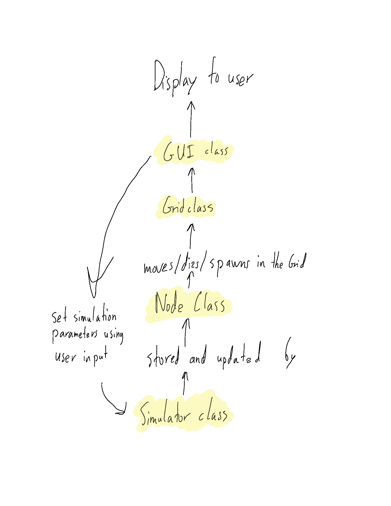
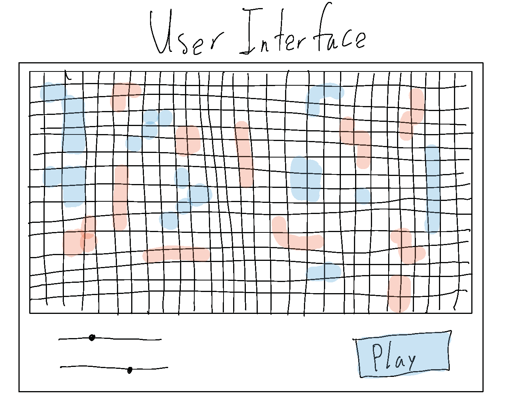

cell society
====

This project implements a cellular automata simulator.

Names: Luke Truitt (lot), Eric Lin (el172), Kunal Upadya (ku16)

###Intro:
We are trying to develop a Cellular Automata that follows the rules of four described simulations. Our major design goal is making it easy to add additional simulations by splitting the work done by each class into its essential features. Open features include the block types, game rules, and grid size. Among closed features are grid shapes, block shapes, and the GUI.
###Overview:
We want to break this problem up into three major design areas: configuration, simulation, and visualization. The configuration will entail the different objects involved in the simulations. Simulation involves updating the locations and colors of the blocks in the grid. Visualization encompasses the GUI and display of the simulation.

Configuration
*Grid.Grid class - keeps track of size and track down individual Nodes at a given location.
*Nodes.Nodes super-class - has generic methods to allow blocks to interact with other blocks and locations in the grid (move, swap, die)
*Specific Nodes.Nodes sub-classes (used to determine what happens in simulation, methods include getAllNeighbors because its specific to the simulation)

Simulation
* Simulation super-class (controls interactions between classes, has an updateGrid method to update the grid after every frame)
* Simulation sub-classes representing each game. Controls interactions between individual nodes, performs game specific actions such as switching state when burned, being eaten, etc, take in user input.

Visualization
* GUI - shows a visual representation of the grid, shows sliders for user input, and a play button. uses a method that converts the grid to an image.
* Animation - play(), step(), runs the animation and holds the active simulator. is the main() function
	

###User Interface:
Square start screen with buttons to pick simulation. Then, it transitions to a screen with an inset grid. Extend the bottom below the grid a bit to allow a pause, play, stop, reset, and game sliders, with an option to select the other simulations. The program will report erroneous input to the left of the play button, with a textlabel.

###Design Details:

*Grid.Grid class: Initialize the grid based on the type of simulation, methods for extracting Nodes at specific locations, resetting grid.

*Nodes.Nodes super-class: Sets the standard size for all Nodes, the location in the grid of the Nodes.Nodes, Interface of methods all block movements. (i.e. Move Left, Remove)
* Specific Nodes.Nodes sub-classes: Specific attributes of each type of block (i.e. color/states)
* Simulation super-class: Baseline methods for scenarios (i.e. Two blocks next to each other.)
* Simulation sub-classes representing each game: Implements the previously explained methods in each games unique way, stores all instance variables.

* GUI: Has different graphical components (i.e. buttons, slider, grid)

* Animation: Provides the engine for the simulation.

To set the state of a block to dead by counting number of neighbors: The simulator would have an arraylist of all nodes, and would check the neighbors by calling a getAllNeighbors method on the instance of the node from the simulator, then counting the number of neighbors for the node. If the node had 4 or more hits, the die method would be called on the node. This would be a killIfDead method in the game of life simulator.

To set the state of a block to dead on the edge, the same process would apply - the getAllNeighbors method would check all adjacent cells to see if they were legal.

To move on to the next generation, the updateGrid method would be called from the simulator. This would update the grid. Then, the updated grid would be used by the GUI, which is always updating.

To set a simulation parameter, the instance variable holding the value of that parameter in simulator would be updated.

To switch the simulation, the active simulator instance would be swapped out for a different simulator.

### Design Considerations:
The major design consideration was how to structure the different simulations. We initially believed setting up the rules and differences between games in the Nodes.Nodes class was optimal, however, after discussing the pros (Makes sense logically to have the Nodes control their interactions) and cons (Potentially too large of Nodes.Nodes sub-classes) we decided to make this part of the simulation sub-class. Opting for the rules of the game to be decided by the Simulation.

### Team Responsibilities:
* Luke - Grid.Grid, Simulation Subclasses, GUI
* Eric - Nodes.Nodes Superclass, Animation
* Kunal - Nodes.Nodes Subclasses, Simulation superclass